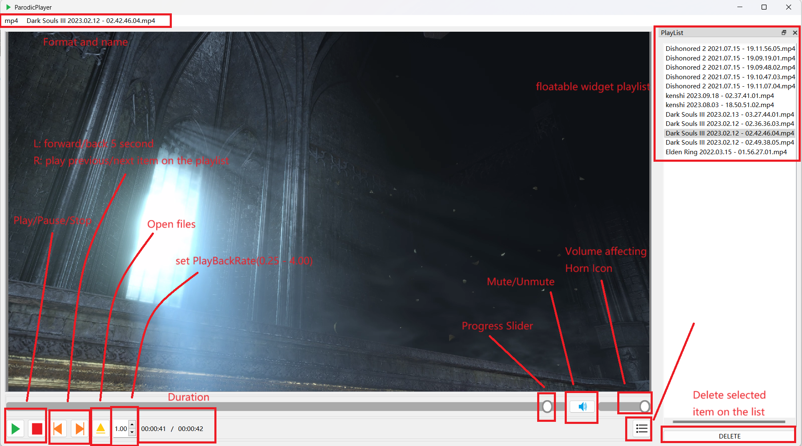

# ParodicPlayer
## Introduction  

*ParodicPlayer* is an audio and video player application based on the *QT MULTIMEDIA* framework and its interfaces and no other third-party decoders have been put in additionally. It is capable of playing a variety of audio and video files.

Qt Version: **Qt 6.5.2** & **MinGW 11.2.0 64-bit**

## Features  

* Supports a variety of audio and video formats, such as MP3, MP4, AVI and so on.  
* Audio and video files can be added via file browser or drag and drop. 
* Supports audio and video playback speed control.
* Provides playlist function automatically updated when you open files. The playlist can be hide and you can drag it to other position as it is floatable
* You can select or drag multi files. the Foremost selected file will be played and all the selected files will be added in playlist.
* Supports Hotkeys which can be used to operate most features of this program.
* Program will generate *setting.ini* into root path for saving volume and the last selected files' path.

## Known issues

1. The first playing video file cannot be the center place when you resize the program widget, the solution is replay or play another video in the current case in which the video graphics is not in the center (to hide or float the playlist is much better).
2. There is a problem that the path & volume values are not correctly read which causes volume to 0 and the path points to the root path. The solution is execute file opening operation to make program save path to *setting.ini* or delete *setting.ini* and let program regenerate *setting.ini*.

## Instructions of the source code

### Compilation and Installation  

1. Make sure you have installed the QT SDK and the QT MULTIMEDIA module. 
2. Download the project file and unzip it. 
3. Open the project file with QT Creator and follow the prompts to compile and install it. 

### Instructions of the Program

#### Basic Instructions

1. Open the *ParodicPlayer* application.  
2. Add one or multiple audio and video files via file browser or drag and drop.  
3. Start playing or select the file you want to play from the list .  
4. Use the playback control buttons (play, pause, stop, etc.) to control the playback process.

#### Program Interface

#### Hotkeys 

**Note:** In current version, not all components transferring keyboard events to the main window. If you clicked on the buttons, sliders, the Hotkeys are not available. For playlist widget and graphics View, the Hotkeys are available.
**Space** - play/pause
**Right Arrow** - forward 5 second
**Left Arrow** - back 5 second
**Alt + Right Arrow** - play next item  on the list
**Alt + Left Arrow** - play previous item on the list
**Up Arrow** - Volume up 5%
**Down Arrow** - Volume down 5%
**O** - open files
**Del** - delete selected item on the list
**L** - show / hide list
**M** - Mute / Unmute

## Project Structure  

### Folder instructions：  
* `src/`：The main source code folder for the project, containing all C++ files.  
* `src/form`：UI design files of the project.  
* `resources/`：Resource files for the project.
### File instructions：  
* `main.cpp`：The main application entry point.  
* `mainwindow.h`：Class for Main Widget and main data.  
* `mainwindow.cpp`：Implement Main Widget.  
* `mainwindow.ui`：ui designed.  
* `classbuttonmouser.h`：Custom Button Class for Right Mouse Pressed.  
* `classbuttonmouser.cpp`：Implement Custom Button Class.  
* `classitemplay.h`：Custom Class for list item.  
* `classitemplay.cpp`：Implement Class item.  
* `classplaylistwidget.h`：Custom Widget Class for playlist.  
* `classplaylistwidget.cpp`：Implement playlist.  
* `funcConnect.cpp`：Functions for main Connect statements.  
* `funcDropEvent.cpp`：Event Rewrite for drag files.  
* `funcInitializePlayer.cpp`：Functions before loading video/audio.  
* `funcKeyEvent.cpp`：Event Rewrite for Hotkeys setting.  
* `funcLocalSetting.cpp`：Local setting for volume & path.  
* `funcSlider.cpp`：Functions for sliders' operation..  
* `validsuffix.h`：Add supporting formats.  
* `validsuffix.cpp`：Add supporting formats.  
